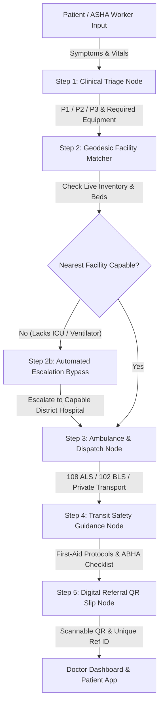

# 🏥 MediBot AI — Smart Public Healthcare Accessibility & Referral Platform

<div align="center">


-success?style=for-the-badge)


</div>

---

## 📌 Project Overview

* **Team Name**: **MediBot**
* **Batch**: **2024–2028**
* **Problem Statement ID**: **SIH26133**
* **Problem Statement**: **Accessibility and quality of public healthcare services, particularly in rural and underserved areas**

---

### 📖 Abstract

> **MediBot** is an AI-assisted digital healthcare platform designed to improve access to quality public healthcare services in rural and underserved areas. It connects patients with suitable healthcare facilities through AI-assisted patient prioritization, healthcare service discovery, smart referral management, and multilingual support, helping users access the right healthcare service at the right time.

---

### 📝 Description

> **MediBot** provides a unified platform for patients, healthcare workers, and public healthcare facilities. Patients can enter their symptoms and basic health information, find nearby suitable healthcare facilities, check available services, and request referrals. The AI module assists healthcare workers in prioritizing cases and recommending appropriate referral pathways based on the provided information. A healthcare dashboard enables monitoring of patients, referrals, and facility services, while multilingual and low-connectivity support improves accessibility for rural communities.

---

## 🌟 Core System Capabilities & Architecture



### 1. 🩺 Multi-Parameter Physiological Triage Engine
- Evaluates real-time patient vital signs against Indian public health clinical protocols:
  - **SpO2 Oxygen Saturation** ($<90\%$ $\rightarrow$ Critical Hypoxemia $\rightarrow$ P1)
  - **Heart Rate** ($<45$ or $>135\text{ bpm}$ $\rightarrow$ Critical Arrhythmia / Bradycardia $\rightarrow$ P1)
  - **Systolic Blood Pressure** ($<90$ or $\ge 190\text{ mmHg}$ $\rightarrow$ Shock / Hypertensive Crisis $\rightarrow$ P1)
  - **Respiratory Rate** ($<8$ or $>30\text{ breaths/min}$ $\rightarrow$ Respiratory Failure $\rightarrow$ P1)
  - **Consciousness Level** (AVPU Scale: Unresponsive / Pain $\rightarrow$ P1)
  - **Maternal & Obstetric Indicators** (Labor Pain / Pregnancy Bleeding $\rightarrow$ P2 Moderate $\rightarrow$ Labor Room / Maternity Ward Routing)

### 2. 📍 Geodesic Haversine Escalation & Facility Matching
- High-precision Geodesic Great-Circle distance calculations across all 5 Indian public healthcare tiers:
  1. **Sub-Centre (HWC)**: Frontline village health post (basic diagnostics, ORS, malaria RDTs).
  2. **Primary Health Centre (PHC)**: 24x7 primary clinic (6 beds, normal delivery, essential drugs).
  3. **Community Health Centre (CHC)**: 30 beds, minor OT, X-ray, basic lab, oxygen concentrators.
  4. **Sub-District Hospital (SDH)**: Secondary specialty surgical and inpatient care.
  5. **District Headquarters Hospital (DH)**: Full tertiary capacity (ICU, Ventilators, Major OT, Blood Bank, CT Scan, Oxygen Plant).

### 3. ⚡ Automated Capability-Aware Escalation & Dynamic Bypassing
- If a patient requires critical equipment (e.g. **ICU**, **Ventilator**, **Major OT**, **Blood Bank**) or inpatient beds, and the nearest PHC/CHC lacks the equipment:
  - System **automatically flags the deficiency**,
  - **Bypasses deficient facilities** with audit reasons,
  - **Escalates to the nearest verified capable facility** (e.g. `PHC -> DistrictHospital`).

### 4. 🚑 108 / 102 Emergency Dispatch & Transit Safety Checklist
- Auto-generates structured dispatch payloads for **108 ALS** (Advanced Life Support - Ventilator equipped) or **102 JSSV** (Maternal transport).
- Provides emergency transit first-aid instructions and mandatory transit document checklists (ABHA ID, Aadhaar, Mother-Child RCH card).

### 5. 📱 Scannable Digital Referral Slip with SVG QR Verification
- Generates a unique digital referral ID (`REF-YYYYMMDD-XXXX`) and embedded cryptographic SVG QR code containing clinical summary, vital warnings, assigned facility, and triage level.

### 6. 🌐 Multilingual & Inclusive Rural Design
- Native support for **English**, **Hindi (हिंदी)**, and **Tamil (தமிழ்)** with voice recognition and text-to-speech.
- Optimized for low-bandwidth and high-contrast accessibility.

### 7. 👨‍⚕️ Healthcare Worker & Doctor Management Dashboard
- Real-time patient monitoring queue, triage badges, bed availability trackers, and referral slip inspectors (`/doctor`, `/dashboard`, `/admin`).

### 8. 📹 Integrated WebRTC Telemedicine
- One-click rural-to-specialist video consultations using official Jitsi Meet WebRTC React SDK (`/telemedicine`).

### 9. 🧠 Hybrid Search & Cross-Encoder Reranking
- LangGraph RAG assistant combining **ChromaDB vector embeddings** (`all-MiniLM-L6-v2`) with **BM25 keyword search** and **Cross-Encoder reranking** (`ms-marco-MiniLM-L-6-v2`).

---

## 🧪 Comprehensive Verification & Test Suite

All 28 backend integration and unit tests pass with **100% success rate**:

```bash
# Run complete test suite
backend\venv\Scripts\python.exe -m pytest backend/ -v
```

| Test Suite | Modules Tested | Status |
|:---|:---|:---:|
| `test_escalation.py` | Geodesic Haversine, P1/P2/P3 Triage Rules, Sub-Centre/PHC routing, Facility Escalation, Live Inventory PUT, 5-Step LangGraph Orchestration | ✅ 13 / 13 Passed |
| `test_full_system.py` | API Health Endpoints, SpO2/Bradycardia/Unconscious Triage, District Hospital Escalation, Transit Safety Checklists, Multi-Agent Chat Endpoint, Hybrid Search | ✅ 15 / 15 Passed |
| **Frontend Build** | Next.js 16 Production Build across all 19 application routes (`/chat`, `/dashboard`, `/doctor`, `/telemedicine`, `/tools`, `/reports`, etc.) | ✅ Zero Errors |

---

## 🚀 Quickstart & Setup Guide

### 1. Backend Setup
```bash
# From workspace root:
backend\venv\Scripts\python.exe -m pip install -r backend/requirements.txt

# Start FastAPI Backend:
backend\venv\Scripts\python.exe backend/main.py
```
* Backend API: `http://localhost:8000`
* Interactive OpenAPI Documentation: `http://localhost:8000/docs`

### 2. Frontend Setup
```bash
cd frontend
npm install
npm run dev
```
* Web Application: `http://localhost:3000` or `http://localhost:3001`

---

## 👥 Team Details

* **Project**: MediBot AI
* **Team**: MediBot
* **Cohort**: Batch 2024–2028
* **Smart India Hackathon (SIH)**: Problem Statement **SIH26133**
